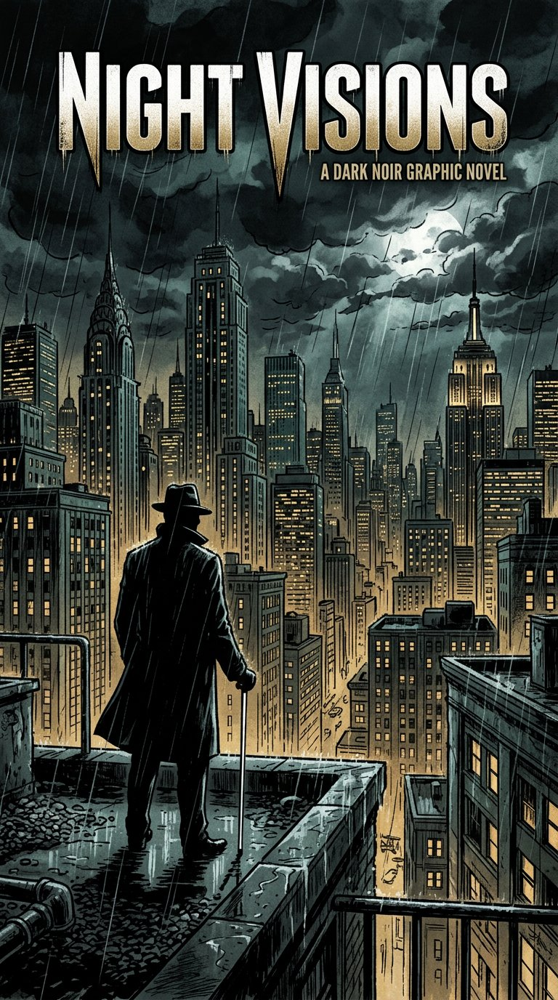

# Capital City Streets

**A blind detective. A murdered sister. A city that wants you quiet.**

[Play the game](https://asfand5302.github.io/capital-city-streets-demo/) — no download, runs in your browser. Headphones recommended.

---

## About

Your sister Salena was killed. The police filed it as an accident. You know it wasn't.

You play as Stoneface — you lost your sight years ago, but not your edge. With Smart Glasses that narrate the world around you and an old SUV named Bonnie, you work through five chapters across Capitol City. From a locked apartment to a mansion gala, every choice matters.

This started as an experiment: what if a game was built audio-first, not visual-first with audio added later? What if blind players got the full experience, not a stripped-down version?

That's what this is.

---

## How it plays

There are two ways to play:

**Story Mode** — Five chapters, branching dialogue, three endings. You move through scenes, talk to people, make calls that change what happens next. The usual detective stuff, but you navigate by listening.

**Explore the City** — Free roam a 20x20 block grid. Walk block by block, find landmarks by sound, set markers, call Bonnie to drive you. There's a lot tucked away if you look.

Both modes are fully playable with just a keyboard and headphones. No mouse needed.

---

## Controls

**Story:**
- Up / Down — move between choices (each one is spoken)
- Enter — select
- 1-9 — jump to a choice directly
- R — replay current line, V — toggle voice, F — focus mode

**City:**
- WASD or Arrows — move
- L — look around, P — sonar ping (like TLOU2's enhanced listen), K — district guide
- G — go to landmark, M — set marker, B — call Bonnie
- Esc — back to menu

Takes about two minutes to get used to. The game teaches you as you go.

---

## Accessibility

Full narration for every line, option, and menu. Binaural 3D audio so you can tell where things are. High contrast mode (press H in-game). 100% keyboard playable. Works on desktop and mobile browsers.

I tested this with screen readers and with eyes closed. If something doesn't work for you, open an issue — I actually read them.

---

## Tech

Built with vanilla JS, Web Audio API for the generative jazz score, and a lot of hand-written dialogue. No engine, no framework. Art is a mix of generated images and simple SVGs. Audio is a mix of real recordings and synthesized ambience.

Saves are local to your browser.

---

## Chapters

1. The First Echo — Salena's apartment, a jingle lock, first blood
2. The Block — Southside, the Velvet Room, new allies
3. Waterfront / Island — Road ambush, the casino
4. The Takedown — Precinct shootout, five hitmen
5. The Grand Finale — Mansion gala, three endings

Plus free-roam Capitol City.

---

## Development

I'm Asfand Ali, solo dev from Islamabad. I built this over a few months because I wanted to make something that actually works well for blind players, not just checks a box.

If you want to see how it's put together, the code is all here. `data/chapters.json` has the entire story. `src/` has the engine. It's not perfect, but it works.

---

## Play

**https://asfand5302.github.io/capital-city-streets-demo/**

Works best in Chrome or Edge on desktop. Mobile works too, but desktop with headphones is the way to go.

---

## Credits

Story, design, code, audio implementation — Asfand Ali

Built at Paschall Game Hub (just me, really).

Special thanks to the open game art and CC0 audio communities — a lot of the noir jazz and SFX are from there.

---

## License

MIT — do what you want with it, just keep the credit.

---

If you play it, let me know what you think. And if you find a bug, tell me — I fix them fast.
